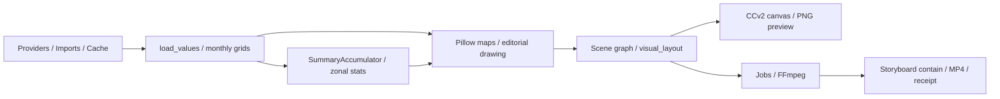

# Ecuador Vivo Studio: arquitectura y plan incremental

## Rediseño UX integrado y validado · 2026-10-08

El workspace predeterminado de `5 · Estudio` es `studio_workspace.show_workspace`. En `app.py` se enruta antes de la sidebar/formularios legacy. `studio_ui.show_studio`, `mount_canvas`, Montaje y todos los contratos anteriores permanecen disponibles y probados. Especificación y comparación de alternativas: [contrato UX](ECUADOR-VIVO-STUDIO-UX.md). CCv2 usa HTML/CSS/JS locales en `workspace_frontend/`, sin dependencias de frontend ni clases internas de Streamlit.

`WorkspaceSession` guarda snapshots después de preflight del render y antes de publicar documento/historial (20 revisiones completas); comandos declarativos incluyen versión y escena para rechazar eventos obsoletos. La navegación temporal se valida antes de aceptar geometría pendiente. Undo/redo incluye nombre, diseño y recursos; autosave/recovery conserva formatos v1. La selección, pan, zoom, guías y pointer gestures reutilizan el controlador de `layout_editor` mediante hooks opcionales; el workspace limpia controllers/handles/observers antes de cada actualización sobre el mismo ShadowRoot. Triggers reciben acknowledgement también para acciones sin cambios en el documento; el frontend libera su estado ocupado y puede seguir consultando el worker.

`studio_workspace_commands` compone los comandos puros existentes: escenas, templates, formatos, grupos, clipboard y propiedades. Cálculos/datasets/legacy se copian y conservan; preflight sigue usando `PreparedTimeline`, `AssetFrames` y `StudioPreviewCache`, sin proveedores ni recálculo por estilos. Inspector contextual muestra bindings, unidades/procedencia/NoData. Timeline edita escenas reales y representa recursos de video/audio existentes; no introduce tiempos independientes ni pistas ficticias.

`studio_server.py` aísla el wrapper público `st.App` (Streamlit 1.65 instalado; API experimental), utilizado por `launch.ps1`. `studio_delivery` expone solo MP4 completos con receipt bajo STORE/jobs mediante FileResponse/Range, token aleatorio 128 bits, TTL de una hora y máximo 64 referencias. Los endpoints no aceptan rutas de usuario. Preview y descarga sirven el mismo archivo del worker, con no-store y MIME video/mp4. Arranque tradicional `streamlit run app.py` conserva el editor/exportación y ofrece preview/descarga nativos como alternativa al endpoint. No servicio adicional ni API privada. No cambio de schemas/export/science.

Checkpoint UX completo: baseline 285 tests actuales OK; cierre **301 tests, 283.806 s, OK**, **85 comprobaciones funcionales Chrome y tres layouts OK** a 1920×1080, 1366×768 y 768×1024. Capturas y logs en `tmp/ux-redesign/` y `tasks/todo.md`; verificador reproducible `verify_workspace_browser.py`. Flujo completo en un mismo proyecto hasta descargas JSON/MP4, proyecto científico real sin recálculos estéticos, comparación de cada cuadro descargado y audio AAC. Compatibilidad canvas anterior 96×3 y CCv2/worker 17 OK. Diff/whitespace comprobados, sin dependencias/commit/push/reversiones.

El inspector conserva foco/cursor/secciones/scroll y campos contextuales pendientes para la misma selección/revisión; un error no borra el valor a corregir ni acepta el documento. Avisos positivos de recuperación están separados de errores. La consulta del worker continúa aunque el proyecto haya cambiado. Regla/playhead siguen posiciones reales de tarjetas con zoom; timeline de 156 px colapsable y paneles propios permiten trabajar en el viewport. Los controles de inputs tienen contraste ≥3:1 y texto ≥4.5:1, incluidos diálogos nativos con tinta blanca. No se afirma certificación de accesibilidad global.

**Checkpoint técnico anterior, 2026-10-08:** 285 tests en 204.606 s OK (`tmp/studio-roadmap-final-full.log`), Chrome 96 checks por tres anchos y CCv2/worker 17 checks OK; diff/whitespace limpio. Familias/roles, paletas, multimedia/audio, preview continuo/animaciones, recovery y recursos/accesibilidad/rendimiento integrados y validados. Se preservan once templates, Scene/Element/model_version=1, CalculationResult, rutas legacy y separación ciencia/presentación. Sin dependencias nuevas ni commit/push/reversiones. Alcances futuros explícitos en tasks/todo.md; el checkpoint UX anterior gobierna esta entrega.

## Continuación actual · composición y audio · 2026-10-08

### Recovery y cierre del roadmap editorial

`studio_recovery.py` escribe snapshots JSON planos compatibles mediante archivo temporal exclusivo, flush/fsync y replace, conserva la versión anterior y ofrece fallback explícito. El snapshot inicial y cada comando aceptado se guardan antes del avance de documento/historial. Abrir copia crea otro borrador, conserva seleccionado y reinicia historial; migración pura y preflight conservan campos, datos, medios y templates. Estado corrupto/estructural inválido no evita acceder al backup. Presupuesto JSON 64 MiB y lista de hasta cien borradores propios. Los gestos no aceptados se conservan por pestaña, escena y hash del documento en sessionStorage; restaurar valida antes de tocar la geometría. Cancelar/incompleto revierte; storage inaccesible muestra aviso. No se promete recuperación después de cerrar la pestaña ni atomicidad ante corte de energía.

`studio_ffmpeg.py` aísla el detalle del generador de la dependencia fijada 0.6.0: EOF con proceso terminado omitía cerrar stdin/stdout. Conserva referencias mediante gi_frame o traceback de fallo inicial, cierra generator, espera proceso/hilo y pipes; no parchea fábrica global ni cambia frames/args. Tests de EOF/earlyclose/metadatafailure con procesos reales y registro de ResourceWarning pinan este puente para futuras actualizaciones. AssetFrames limpia todos los lectores; caché suelta imágenes propias en evicción/clear. Lectores de tests que invocan directamente la dependencia y warnings Streamlit/Rasterio no equivalen a una fuga nueva del pipeline protegido.

Estados de capas/lock/visibilidad disponibles mediante aria-pressed, mensajes y teclas; alternativa de posición/tamaño numérica, foco visible, targets y responsive existentes conservados. Chrome 96 checks por tres anchos y tests de contraste/labels/foco/targets OK. No se afirma auditoría/certificación global de accesibilidad. Animaciones none/fade/slide/scale/wipe y preview continuo verifican cada frame; slide a progreso cero corregido para respetar retraso de entrada. El video nunca reproduce automáticamente.

Medición final local: fixture previa 60 frames/30.000 filas, preparada 0.567 s vs referencia 3.397 s (~6×); once templates cold 1.196 s vs warm 0.015 s, caché 161.641 bytes (tres muestras). Se conserva protección de hashes y límites. Registro `tmp/studio-final-performance.json`; resultados indicativos de esa fixture. Suite final 285 OK; checkpoints y alcances concretos en tasks/todo.md. Narración/música/SFX independientes quedan como extensión futura solicitada; no se presentan como funcionalidad implementada.

Grupos persistentes mediante group_id plano/aditivo, sin jerarquías ni cálculo geométrico oculto. Copia crea otra identidad y conserva desplazamiento común; grupos parciales/bloqueados se rechazan. Chrome: 87 checks por tres anchos y CCv2/worker: 17. Rotación de multimedia/formas centra el raster completo dentro de su caja nativa; cero conserva píxeles y mapas mantienen proporción. Textos y visualizaciones no admiten giro por ahora.

`studio_audio.py` separa el proveedor `video_sources`, el schedule inmutable `AudioSource`, la suma PCM por bloques y el mux/limitador. Es el punto de extensión para futuras pistas de narración/música/SFX: otro proveedor podrá devolver fuentes independientes con asset seguro, trim, inicio/duración global, gain y loop, usando el mismo mezclador. Esas pistas todavía no tienen UI ni schema público; no se aceptan campos que el export ignore. Scene/Element/model_version=1 y CalculationResult conservan contrato.

Audio original por video visible: mute booleano (default True), volume lineal 0..2 (default 1). Mute/ganancia cero/hidden/editor_deleted/video sin stream de audio producen silencio. Opacidad y animaciones no son envolventes de audio. Reloj 30 fps/48 kHz estéreo, 1600 muestras/cuadro; trim cuantizado idéntico al video, repetición del tramo completo y silencio al terminar un clip no-loop. Los huecos PTS se conservan antes de cortar: `aresample async=1:first_pts=0:min_hard_comp=0`, incluida regresión de 85,33 ms. Mezcla en bloques de un segundo, PCM temporal en disco con presupuesto de 8 GiB y comprobación de espacio libre; sin buffers de película completos. Hash verificado antes/después de decodificar y antes de publicar. Cancelación termina/recolecta subproceso y borra temporales propios.

Video ya codificado se copia al mux; AAC estéreo a 48 kHz/320 kbit. Limiter con techo 0.90, level=0 y latency=1 según [FFmpeg](https://ffmpeg.org/ffmpeg-filters.html#alimiter); resampling/PTS según [documentación del resampler](https://ffmpeg.org/ffmpeg-resampler.html). Pico del AAC decodificado medido antes de publicar; hasta tres intentos de atenuación si supera 0.98, error sin producto final si no cumple. Receipt incluye fuentes/schedule, muestras, pico y ajuste. Diez pruebas focalizadas y AppTest/worker real cubren mezcla, niveles, mute, trim/loop, silencios/fronteras/PTS, publicación/cancelación y conservación de cuadros. Suite completa: 276 tests, 398.395 s, OK; Chrome/CCv2/worker 17 checks OK.

“Preparar preview audiovisual” usa el mismo worker y MP4 que “Exportar”; st.video reproduce el archivo que descarga el usuario. Cambios posteriores muestran aviso explícito de snapshot antiguo. Preview de cuadro permanece frame-exact con Pillow. Así se incorpora preview continuo y audio sin otro motor ni dependencia. Tras cerrar validación, sigue autosave/recovery, accesibilidad/recursos y rendimiento/UX. Checkpoints históricos siguientes describen sus fechas y no sustituyen este estado.

Fecha: 2026-10-07. Inspección del árbol de trabajo, no solamente de HEAD.

## Contrato y seguridad

La especificación del usuario autoriza auditoría, correcciones demostradas y evolución incremental. Prioridad: ciencia, preservación, compatibilidad, mantenibilidad, WYSIWYG e interacción. No commits, push, cambio de rama ni eliminación de datos. En el inicio había cambios en `.streamlit/config.toml`, `app.py`, `climate_comparison_ui.py`, `layout_editor.py`, `spatial_csv_ui.py`, `storyboard_ui.py`, `workspace.py`; también `test_interface.py` y `documentation/VIDEO-STUDIO-UI.md` sin seguimiento. Se conservan. No se encontró AGENTS.md con la búsqueda recursiva de archivos ocultos excluyendo Git y dependencias.

## Arquitectura encontrada (IMPLEMENTADA antes de esta evolución)

| Módulo | Responsabilidad y contrato existente |
|---|---|
| `production/video_studio/app.py` | Entrada Streamlit; carga proyectos, datos, controles, previews y jobs; recarga módulos en hot reload. Navegación Datos/Maqueta/Montaje/Exportar. Tres modos: temporal, comparación y CSV geográfico. |
| `model.py` | Proyecto diccionario, `version=1`, `template_version=7`, `upgrade_project`, `validate`, `timeline`, `frame_counts`. Importaciones restringidas a STORE/imports. |
| `data.py` | Cache CHIRPS v2, límites ADM0/ADM1, uploads por hash, inspección de bandas; `_polygon_stats` sobre píxeles nativos; `load_values` devuelve datos de display y metadatos zonales. |
| `variables.py` | Detección heurística del significado físico y operación sum/mean; rechaza suma intensiva y dirección; textos del cierre. Depende también del título/descripción editorial. |
| `providers.py` | CHIRPS v3 prelim/final sat/final rnl, POWER regional diario, INAMHI puntual diario; originales, archivos derivados, manifiestos, fechas faltantes, hashes. |
| `climate_comparison.py` | Grillas mensuales nativas, requisito de días completos por píxel, estadísticas zonales, ranking temporal ponderado por días, parser CPC, script Earth Engine. |
| `comparison_maps.py` | Cache de campos nativos por firma de fuente, comparación espacial, escala común, reproyección exclusivamente para display. |
| `endcard.py` | `SummaryAccumulator`, resumen diario/mensual/provincial y cierre Pillow; dimensiones de referencia 941 px y maqueta vertical. |
| `render.py`, `maqueta.py`, `social.py`, `editorial.py` | Composición Pillow compartida entre PNG y frames; maqueta fija 1080×1920, mapa continental e inset; tipografía y dibujos. Barlow Condensed distribuida con OFL; fallbacks Windows/DejaVu/Pillow. |
| `layout_engine.py` | Scene graph por imagen, captura de capas PNG, claves de dibujo, overrides `visual_layout.map/endcard`, custom text/icon, proporción de mapa/icono, render ordenado por z. |
| `layout_editor.py` | Componente inline `st.components.v2`: selección simple, drag/resize, inspector, historial, delete/recover, guías; OK guarda borrador separado. Reutiliza capas del render Python. |
| `storyboard.py`, `storyboard_ui.py` | Montaje práctico: map/endcard/snapshot/image/video/text; formatos 9:16/16:9/1:1/4:5/4:3, 1080p/720p; contain para ciencia, cover opcional para medios; normalización FFmpeg a 30 fps, audio/trim/créditos/hashes. |
| `spatial_csv.py`, `spatial_csv_ui.py` | Puntos WGS84 o valores provinciales; rechazo explícito de filas inválidas/duplicados; conteo de registros, no población; visualización y exportación. |
| `comparison_video.py`, `climate_comparison_ui.py` | Previews geográficos, cierre, resumen comparable y exportación MP4/CSV/receipt; UI incluye ENSO y exploración de viento. |
| `jobs.py` | Workers independientes, status atómico, cancelación, hashes y `receipt.json`; resultados incompletos no publicados como completos. |
| `workspace.py`, `publication.py` | Navegación/export checks; prepara borrador Andes Pulso con permisos explícitos para coordenadas; nunca publica automáticamente. |

### Dependencias fuera de la carpeta

Entrada de usuario: `Abrir editor de videos.vbs` → `production/video_studio/launch.ps1` → `_local/video-studio/.venv/Scripts/python.exe -m streamlit run app.py`, loopback 8510. STORE es `_local/video-studio`, excluido de Git. `data/raw/catalog-inputs/geoBoundaries-ECU-ADM1.geojson` proporciona 24 provincias; `data/geojson/estaciones-inamhi.geojson` enriquece estaciones; `_local/climate-studio/*` comparte cache histórica ADM0/CHIRPS v2. `publication.py` integra el catálogo `data/cases/registry.json` y assets del sitio. `production/site_admin` referencia el lanzador del editor. `production/monitor` contiene producciones audiovisuales y scripts científicos independientes; no reemplazar sus motores dentro de este cambio. El sitio web usa `assets/js`, scripts, datos y tests propios.

Stack fijado: Streamlit 1.65.0, NumPy 2.4.3, Pillow 12.1.1, Rasterio 1.5.1, imageio-ffmpeg 0.6.0, pandas >=2.2,<4. Altair se importa a través del entorno Streamlit. Node >=22/pnpm 11.19.0/ESLint pertenecen al sitio. CI valida el atlas y tests raíz, pero no instala ni ejecuta la suite del editor.

### Flujo actual

La dirección actual incluye cálculo durante rendering y composición antes de captura de elementos. Preview y export comparten Pillow; las modificaciones de texto/color del navegador se ven al aplicar OK, no inmediatamente. El frontend encaja el canvas vertical en el formato de salida, como `storyboard.format_preview`; eso conserva proporción pero no es layout adaptativo.

## Diagnóstico y decisiones

Conservar validación, seguridad de paths, receipts, caché, render Pillow, scene graph, providers, jobs, cancelación, montage y tests. El scene graph existente es un adaptador útil para Legacy/Custom Layout; sus IDs derivados de función/callsite no sustituyen IDs persistentes de elementos libres.

Acoplamientos: app monolítica; variables físicas inferidas de copy editorial; cálculo diario desde display para GeoTIFF local; cierre y comparación realizan agregaciones temporales distintas; carga del inset mezcla lectura/render/estadística; listas de formatos y tamaños dispersas. Coordenadas y guías fijas aparecen en `maqueta`, `endcard`, `editorial`, `render`, `layout_engine.payload` y JS del editor. `upgrade_project` modifica el diccionario y fuerza maqueta en versiones antiguas; la evolución debe preservar el original y no repetir cambios de fábrica sobre diseños manuales.

**Hipótesis a verificar con tests:** una lectura nativa separada permite que cambios de resolución/display no cambien métricas; un esquema aditivo e idempotente conserva campos legacy; perfiles de salida no deben escalar una plantilla vertical cuando se diseñe el nuevo editor. Ver reporte científico para evidencia y riesgos.

Streamlit puro no proporciona handles/marquee/drag/zoom de un editor. El repo ya contiene CCv2 inline: evolucionar ese componente sin framework nuevo, manteniendo Python para ciencia, archivos y render. No se añade dependencia en la primera entrega. No se presume una safe area oficial por plataforma: ayudas iniciales serán márgenes editoriales editables y expresamente orientativos.

## Mapa de capacidades y arquitectura objetivo (PROPUESTO salvo registro final)

| ID estable | Contrato | Depende de |
|---|---|---|
| scientific-results | VariableSpec explícito, conversión, operaciones, CalculationResult y provenance; independencia del diseño | providers existentes |
| project-model | schema_version, escenas/elementos/timeline; migración pura e idempotente preservando legacy | — |
| output-profiles | dimensiones, márgenes orientativos, geometría adaptativa y precisión manual | project-model |
| visualizations | DataBinding seguro, VisualizationSpec separado de UI; consumidores del mismo resultado | scientific-results, project-model |
| canvas-editor | selección/capas/inspector/comandos/historial | project-model, output-profiles |
| scene-timeline | escenas arbitrarias, duración/order/playhead | canvas-editor |
| media-library | assets locales verificados, imagen/video por elemento | project-model, seguridad storyboard |
| render-export | geometría única, previews/PNG/frames/MP4/receipt | visualizations, scene-timeline, media-library |
| design-library | templates editables, themes/tipografía/paletas independientes del dato | project-model, output-profiles |

CalculationResult: valor(s), unidades internas/finales, variable, periodo, dominio espacial, operaciones, weighting, cobertura/píxeles válidos, versión del método y hashes. DataBinding: dataset/result ID + campo(s), sort/filter/Top N declarativos; nunca eval/exec. VisualizationSpec: tipo, binding, estilo; renderer puro. Project/Scene/Element: IDs persistentes, transform/style/binding/animation/visibility/lock/z; scenes + timeline referenciados por IDs. OutputProfile: tamaño y guías; mapas siempre contain/uniform scale. Estos contratos se implementarán gradualmente, sin afirmar que el editor libre ya existe.

### Migraciones

Introducir schema_version independiente de version/template_version; conservar desconocidos, visual_layout, map/endcard/storyboard/delivery y entradas originales. Migración devuelve copia profunda, rechaza esquemas futuros y nunca sobrescribe el archivo original. Escenas legacy se identifican como referencias al render existente, no como elementos inventados. Los nuevos datos/modelos se incorporan sin cambiar la ruta de export legacy hasta verificar integración.

### Plan y criterios de aceptación

1. Baseline y auditoría: 115 tests existentes pasaron en 111.591 s con el entorno del editor. Reproducciones antes de fixes; evidencias y fuentes en el reporte.
2. Correcciones científicas: integer masked rasters, negativos en display y resumen nativo; tests sintéticos independientes del algoritmo; método/cobertura/dominio en receipt. No seguir con errores graves confirmados.
3. Fase 1: modelo aditivo compatible, migración idempotente, Scene/Element y bindings validados; tests roundtrip/no mutación/esquemas futuros/referencias/entradas hostiles.
4. Perfiles y geometría: 1080×1920/1350/1080 y 1920×1080, custom par para codec; variantes reales para nuevas escenas, legacy intacto.
5. Editor por vertical slices: first scene → element → layers → inspector → render/PNG; después multiselection/snapping/zoom y timeline. Ninguna operación visual recalcula ciencia.
6. Visualizaciones KPI/bar/dot/lollipop/line/ranking/comparison primero; misma CalculationResult. Templates/themes después de comprobar geometría.
7. Medios compuestos, data→visualization, animaciones deterministas; autosave/recovery/performance/accesibilidad.

Comandos desde la raíz, PowerShell: `& './_local/video-studio/.venv/Scripts/python.exe' -m unittest discover -s production/video_studio -p 'test_*.py' -v`. Focus: cambiar patrón por el archivo nuevo. Sitio: `pnpm run check`; tests raíz según CI `python -m unittest discover -s tests` con dependencias respectivas. No ocultar resultados fallidos ni omitir tests por falta de cache/red.

Pruebas: fixtures 2×2 (0, NoData, negativos, scale/offset), geográficas/proyectadas, dominios continental/islas; expected explícitos. Migración y JSON sin pérdida, safe paths, budgets, IDs únicos y referencias. Geometría/píxeles compartidos preview/export, mapas sin deformación. Integridad: editar estilo/layout/tema no cambia CalculationResult. Browser runtime imprescindible al tocar JS; pruebas geométricas además de screenshots.

## Registro de implementación · primer incremento (histórico)

| Incremento implementado | Evidencia | Límite actual |
|---|---|---|
| Estadística nativa del dominio en `data.native_domain_stats`; resumen/preview/jobs/inset local la consumen | 2×2: media 10, cero válido, -4, conversiones, sentinel exacto, coverage 3/4; pesos geográficos explícitos y projected mean 50 | Centros de píxel, sin cobertura fraccional; projected pixel mean no presupone equal-area; agregaciones parciales/mensuales pendientes |
| `schema_version=1`, `studio_model.migrate_project`, Scene/Element/DataBinding | Migración pura/idempotente, JSON, versiones, referencias y no mutación; todos los campos legacy conservados | API disponible; no convierte automáticamente proyectos abiertos en escenas libres |
| `output_profiles.py`: 8 presets, custom, márgenes y regiones adaptativas | Cuatro formatos, selección/reapertura con AppTest, entrada impar conserva último perfil válido | Regiones todavía no aplicadas a maquetas legacy; su export sigue contain |
| Canvas CCv2: capas, rename/lock/visibility/reorder, zoom fit/25–200 %, pan Alt, Shift en un eje, Escape, flechas y undo/redo | Persistencia y geometría; Chrome real en tres anchos, 12 checks por ventana | Selección única; faltan group/rotation/marquee; texto/color redibujados al aplicar OK |
| `calculation_results.py`: resultados inmutables y bindings seguros sobre el resumen existente | Valores/unidades/dominios preservados; copias independientes; sort/Top N determinista, negativos/0/None | No reemplaza todas las agregaciones; source_units=None si no se conoce la unidad raw |
| `visualizations.py`: KPI/Metric/horizontal bar/vertical bar/dot/lollipop/line/ranking/comparison | Geometría/render Pillow comunes, baseline 0, línea cortada en NoData, comparación requiere dos observaciones con igual cobertura | X de línea es categoría ordenada equidistante, no tiempos inferidos; no inventa % o metodología |
| `visualization_ui.py`, Maqueta → Visualizaciones | Carga científica explícita; styling sin recálculo; PNG seguro y snapshot de spec/resultado/hashes al montaje/receipt | Tarjeta estática: regenerar al cambiar datos/estilo/formato; todavía no elemento vivo en canvas |
| `studio_render.py`: escenas libres con texto/source/metric/chart/ranking/shape/background/map/image/logo | Scene graph existente; dimensiones nativas por perfil, mapas contain, PNG = render; registry sin mutación | API todavía sin editor/timeline/MP4 propios. Rotation/animation/video/group fallan explícitamente. Export legacy rechaza escenas libres |

Receipts conservan campos anteriores y añaden CalculationResult, versión de método y dominios separados. Cada lectura nativa registra cobertura/conteos; una tarjeta científica conserva su propio snapshot de fuentes separado del source_records del mapa actual. No se añaden paquetes.

Revisión adversarial adicional: cinco defectos reproducidos y corregidos con RED/GREEN. El periodo efectivo se obtiene de las observaciones/imports y se separa del periodo configurado. Las versiones de archivos CHIRPS participan en la identidad/cache sin descargar durante styling. La captura explícita calcula hashes antes/después y usa un token de contenido en el cache científico; si una fuente cambia durante la operación falla y pide repetir. El snapshot tiene checksum de metadatos ligado al hash PNG, y antes de exportar se comprueban los píxeles contra el render desde spec/result. No es autenticación de la calidad de una fuente externa. Advertencias de periodo/cobertura parcial se muestran en UI y en la imagen exportada. Las referencias legacy Studio que cambian orden/duración/nombre no se ignoran: esa ruta rechaza la discrepancia antes de mutar el proyecto.

Verificación desde raíz: `& './_local/video-studio/.venv/Scripts/python.exe' production/video_studio/verify_canvas_browser.py`. Monta HTML/CSS/JS exactos en shadow DOM con Chrome headless y perfiles temporales; comprueba teclado/locks/layers/undo/redo/zoom/responsive. CUA falló en esta sesión; esta alternativa no sustituye la revisión manual ni valida todo el transporte CCv2. El observer difiere sus escrituras de geometría al siguiente animation frame para evitar loops de ResizeObserver.

El test real de FFmpeg compara PNG original con preview byte a byte y MP4 decodificado con tolerancia por compresión; verifica seis frames y procedencia. Detectó pérdida del último frame al remuestrear a 30 fps una base científica que ya era CFR 30: el montaje conserva esa secuencia con timestamps por índice. Clips externos siguen normalizando fps.

Baseline 115 tests OK; checkpoints completos 121, 131, 146 y 170 OK. **Checkpoint posterior a revisión: 175 tests en 158.521 s, OK**, comando discovery completo de `test_*.py`; log local `tmp/studio-final-reviewed-check.log`. Chrome: tres ventanas con 12 checks por ventana, OK; diff check sin errores. Los mensajes de FFmpeg sin frames corresponden al test deliberado de cancelación, no a una exportación presentada como completa. No se ocultaron fallos ni se omitieron tests.

Se preservaron cambios locales de UI; no se cambiaron ramas ni hubo commits/push. Al terminar el primer incremento quedaban pendientes editor libre integrado, multiselection, timeline visual, templates/themes, multimedia compuesto, animación y recuperación. El resumen está cacheado por identidad científica; la recaptura del mapa seleccionado aún puede releer esa fecha tras aplicar un diseño. La biblioteca de visualizaciones evita ese cálculo durante styling y mantiene los resultados separados del diseño.

## Checkpoint de cierre · segundo incremento · 2026-10-07

**Estado: implementación parcial, detenida por el usuario; no cierre de integración.** No se añadió ninguna dependencia. No hubo commits, push, cambios de rama ni reversiones. Los cambios previos del usuario y del primer incremento siguen presentes. Este apartado reemplaza las afirmaciones de capacidades actuales del registro histórico cuando haya diferencias.

Cierre solicitado: `git status --short` consultado y `git diff --check` con exit code 0. Único aviso: LF→CRLF en el config local de Streamlit. Los archivos untracked siguen sin incorporarse a Git; diff check no los incluye. No se ejecutaron nuevos tests después de la instrucción de detener desarrollo.

### Módulos y flujo existentes en el árbol de trabajo

`app.py` ofrece la fase adicional **Estudio**, después de Datos/Maqueta/Montaje/Exportar, y enruta a `studio_ui.show_studio` antes de las rutas científicas específicas. El editor mantiene una copia de trabajo independiente en session state; `new_workspace` conserva el proyecto raíz, las escenas legacy y su timeline original, y crea una secuencia libre. Las ediciones aceptadas escriben un borrador con nombre nuevo en `STORE/projects`; no reemplazan el archivo original. El JSON Studio descargable conserva los campos legacy. La exportación legacy mantiene sus guardas contra cambios Studio ignorados.

| Módulo | Implementación presente | Evidencia / límite |
|---|---|---|
| `studio_editing.py` | Comandos puros de escenas, patch del canvas, adaptación explícita por regiones, duplicación de elementos y anexado de revisiones científicas | Conserva bindings y registros; retiro de timeline conserva escena recuperable. Requiere suite final tras ampliaciones |
| `studio_templates.py` | Cinco templates: vacío, portada, mapa+métrica, mapa+ranking, cierre; diez temas, siete presets tipográficos, cuatro paletas con tipo declarado | Templates editables y geometría por perfil; mapa inicial es un placeholder visible, no un mapa científico generado. Biblioteca completa y más familias/roles pendientes |
| `studio_ui.py` | Canvas existente, formularios de propiedades, escenas, templates/themes, multimedia, bindings, timeline CCv2, playhead, preview de cuadro, PNG/JSON y exportación | AppTest de operaciones básicas pasó; falta transporte/browser completo y ejecución UI → worker → descarga |
| `layout_editor.py` | Shift+clic, marquee, Ctrl+A en canvas, movimiento/resize múltiple, eliminación y undo/redo; copy/paste/duplicate para escenas libres | Se conserva componente legacy. Selección temporal múltiple no equivale a grupos persistentes. Últimos cambios de resize tipográfico aún sin validación Chrome concluida |
| `studio_media.py` | Importación content-addressed reutilizando `store_media`, paths limitados a biblioteca local, hashes y budgets, imágenes y decoder CFR para video con trim/loop | 100 MB/recurso, 40 MP/recurso y presupuesto de imágenes antes de carga; video silencioso. Seek comienza en segundo entero cercano al cuadro, no decodifica todo trim_in. VFR/seek secuencial vs aleatorio pendiente |
| `studio_render.py` | Render nativo compartido de elementos, video resuelto por ID, alineación de texto, opacidad y none/fade/slide/scale/wipe deterministas | Animación sin duración válida y propiedades desconocidas fallan; rotación, grupos y otros elementos no soportados no se ignoran. Canvas edita estado final; preview temporal usa playhead |
| `studio_timeline.py` | `frame_at`, timing cuantizado 30 fps, preflight y MP4 desde el mismo render; receipt con timeline/calculations/datasets/media/hashes | FFmpeg sintético de seis cuadros pasó. Protege MP4/parcial/receipt/project existentes. Validación/copia por cuadro y caché de capas requieren mejora |
| `studio_jobs.py` | Ruta de subprocess independiente, request.json, estados, cancel.request, MP4/project/receipt al éxito | No reemplaza worker legacy. Worker real/UI aún sin validación de extremo a extremo |

Flujo implementado: **snapshot explícito ya calculado → revisión en `studio.calculations` + fuentes en `studio.datasets` → binding → Element → Scene → timeline a 30 fps → `frame_at`/`render_scene` → PNG o MP4 → receipt**. `attach_snapshot` genera IDs derivados del contenido de la revisión; vincular una revisión posterior conserva la anterior y sus bindings. La UI comprueba identidad de la fuente al vincular. Styling, movimiento y animación no llaman proveedores ni recalculan estadísticas. No se añadió un motor científico alternativo.

`canvas_payload` recompone cajas completas con padding transparente desde tiles/posiciones capturados por el render existente. Así, mover un asset con contain no acumula offsets de centrado ni deforma el contenido. Las guías usan márgenes editoriales del perfil y no se exportan. El preview temporal y la exportación invocan la misma función de cuadros; la rasterización interactiva durante drag/text edit se confirma y redibuja al aplicar. El resize tipográfico fue ajustado para guardar la escala de fuente en escenas libres; su interacción final todavía debe probarse en navegador.

### Revisión y verificaciones efectivamente realizadas

- Baseline inicial de esta sesión: **175 tests, 170.711 s, OK**, `tmp/studio-increment2-baseline.log`.
- Comandos/templates: `test_studio_editing.py`, 5 tests OK, antes de ampliaciones posteriores.
- Discovery focalizado `test_studio*.py`: **43 tests, 44.392 s, OK**, antes de las últimas correcciones.
- Última verificación focalizada: **7 tests de `test_studio_timeline.py`, 0.432 s, OK; 4 tests de `test_studio_ui.py`, 3.129 s, OK**. AppTest impide llamadas a `data.load_values` durante operaciones visuales. Regresiones cubren texto sin recorte, cambios desconocidos, metadata de bloqueo, contain, integridad de revisiones, budgets y archivos existentes.
- FFmpeg real: MP4 320×180 con seis cuadros, fronteras de escenas 0–2/3–5 y colores comparados con `frame_at` usando tolerancia por compresión. Imágenes y video sintético de tres cuadros también probados; no hay todavía validación completa de animaciones/video de fuentes reales en el worker.
- Chrome completado: tres anchos 1422/750/504, **12 checks por ancho, OK**; también 3 tests de `test_canvas_features.py` OK. Esta ejecución antecede a los últimos handlers y a los checks ampliados de timeline/multiselección.
- La última llamada que ampliaba y ejecutaba `verify_canvas_browser.py` fue interrumpida. **No se obtuvo resultado confirmado de los checks ampliados**; revisar su contenido y repetirlos al retomar. No presentar esa llamada como validación aprobada.
- **No se ejecutó la suite completa sobre el estado final del segundo incremento.** Los 175 tests completos corresponden al baseline. Al cierre el usuario autorizó únicamente `git status --short` y `git diff --check`, además de actualizar documentación.

La revisión adversarial detectó truncado de texto, patch filtrado silenciosamente, registro CSS inline inválido, desbloqueo rechazado por metadata derivada, presupuesto de imágenes aplicado tras cargar todas, sobrescritura de project.json, trim decodificado desde cero y tamaño de texto distinto al guardar. Se añadieron correcciones/regresiones; los tests focalizados anteriores pasaron. El ajuste final de resize y otros handlers precisa revisión de navegador. Esto no certifica todo el incremento.

### Pendientes y warnings para reanudar

Siguiente tarea exacta: **revisar la ampliación interrumpida de `verify_canvas_browser.py` y validar multiselección, marquee, resize tipográfico, atajos y timeline en Chrome; corregir esos contratos antes de cualquier nueva funcionalidad.** Después repetir los tests nuevos, ejecutar discovery completo y probar UI → job Studio → receipt/descargas con un clip VFR o distinto de 30 fps.

Riesgos abiertos: timeline mixta legacy/free (la exportación dedicada la rechaza; faltan herramientas para resolverla), perfiles custom pequeños/texto que no cabe, presupuesto y reutilización de cuadros multimedia entre escenas, repeated media loading/rerender en reruns y validación JSON por cuadro, navegación con cambios pendientes, transporte CCv2 completo, copy/paste entre escenas y cancelación real del worker. Rotación, grupos persistentes, audio compuesto, reproducción continua del preview antes de exportar, autosave de gestos sin aplicar y recuperación durable de sesión siguen pendientes. Existen borradores y undo/redo acotado, no un sistema completo de recuperación/snapshots.

Warnings conocidos: Streamlit missing ScriptRunContext en bare mode/AppTest; PendingDeprecationWarning de Rasterio; FFmpeg sin cuadros en tests deliberados de cancelación; aviso LF→CRLF del config local al comprobar Git. El sandbox de shell falló en esta sesión y las lecturas/tests se ejecutaron mediante escalación. CUA no estuvo operativo en el incremento anterior; Chrome headless comprueba el JS/DOM, sin certificar todo el transporte CCv2. No ocultar estos límites al continuar.

## Reanudación verificada · 2026-10-07

Este registro sucede al checkpoint interrumpido; conserva el historial anterior. La ampliación del harness no había quedado aplicada. Se retomó antes de añadir funcionalidades y se amplió a 49 comprobaciones por ancho real de Chrome (1422/750/504): multiselección, marquee, drag/resize, tipografía, locks, delete/recovery, undo/redo/cancelación, portapapeles y eventos de timeline.

Correcciones reproducidas antes de implementar:

- El historial de un gesto se registra al terminar; cancelarlo conserva redo y los 40 pasos anteriores. Marquee recupera su selección inicial al cancelar. Atajos de teclado y portapapeles finalizan el gesto antes de emitir otra acción.
- El canvas usa la fuente efectiva del render, también para fuentes implícitas y texto ajustado. Mover/desbloquear no materializa una fuente que no cambió. Resize aplica un factor común limitado por 8–400 px y calcula la fuente antes de redondear las dimensiones. Reordenar no modifica un vecino bloqueado.
- Seek VFR conserva timestamps con `copyts/start_at_zero`, retiene el predecesor con `noaccurate_seek` y deja que el filtro `fps` haga el único muestreo a 30 fps; la salida usa `fps_mode=passthrough`. Se probaron accesos aleatorios, trim/loop y cuadros separados por diez segundos. [FFmpeg documenta seek y conservación de timestamps](https://ffmpeg.org/ffmpeg.html); [fps define el muestreo y padding](https://ffmpeg.org/ffmpeg-filters.html#fps-1). El offset de seek solicitado es acotado; la decodificación efectiva puede comenzar en un keyframe anterior según el GOP.

`verify_studio_transport.py` ejecuta Chrome contra un servidor Streamlit aislado: el JS de producción escala dos elementos, aplica mediante CCv2 real, selecciona/reordena escenas y mueve el playhead; luego el botón real inicia el worker. La verificación comprueba modelo guardado, fuentes/resultados, seis cuadros, receipt y diferencia media PNG/MP4 <5 por compresión. 15 checks OK. Los gestos son sintéticos y pointer capture se sustituye en el harness; esto no certifica hit testing de puntero físico ni toda la accesibilidad.

`test_studio_jobs.py` cubre AppTest → subprocess real → MP4/receipt/descargas, y cancelación sin productos completos. `Editar solo escenas libres` resuelve una timeline mixta mediante una acción explícita: mantiene todas las escenas y guarda referencias legacy, conservando los registros científicos y el montaje anterior.

`PreparedTimeline` copia y valida el proyecto al crearse, cuantiza escenas una vez y reutiliza el render interno validado en UI/export. Sus accesores de proyecto/filas devuelven copias; el adapter de assets recibe copias de elementos. `render_scene` y `frame_at` conservan la API validada anterior. Persisten las guardas de estilos/bindings/animación y píxeles en cada render; se evita repetir la validación/JSON del documento y registry completo. No hay cache global de datos ni de archivos multimedia. Tests comparan píxeles y modificaciones externas; la fixture de performance (60 cuadros, 30.000 filas, tres muestras) dio mediana 0.980 s → 0.215 s incluyendo preparación y protecciones finales. Es una medición sintética, no una promesa de velocidad para todos los proyectos.

Export valida todo el documento como JSON finito y el máximo de dos horas después de cuantizar a 30 fps. Requiere destino `.mp4` nuevo y reserva exclusiva del directorio; conserva staging/reservas previas. Escribe sidecars en staging propio y publica el MP4 después de project/receipt. Errores normales de escritura, publicación o limpieza de reserva/media retiran productos finales propios. La reserva y archivos parciales pueden quedar tras una interrupción abrupta; no se afirma atomicidad entre tres archivos frente a un corte de energía. Los tests inyectan fallos y verifican que no se ofrecen productos completos desde un job fallido.

Estado final de esta continuación: **208 tests, 245.251 s, OK**; Chrome 3×49 checks; CCv2/worker real 15 checks; diff check y whitespace de 15 archivos completos OK. Evidencia y siguiente pendiente: `tasks/todo.md`. CUA continúa sin iniciar por el error de sandbox; el transporte CCv2 se verificó con Chrome headless y Streamlit real. No se agregaron dependencias, no hubo commit/push y no se repitió ni modificó la auditoría científica. El roadmap completo sigue abierto según los límites registrados.

## Cache de presentación por sesión · continuación

`studio_cache.py` mantiene LRU de imágenes/metadata y de payload/thumbnail/PNG en `st.session_state`, con presupuestos contables de 32 MiB cada una y 512 entradas máximas. No contiene CalculationResult calculados ni readers vivos; las referencias usadas en claves son snapshots JSON ya validados. El overhead de objetos Python y los buffers temporales de render quedan fuera del contador.

Cada rerun y preflight crea `AssetFrames`: verifica paths, tamaños, hash de los bytes reales y presupuesto combinado de imágenes/cursors también en hits. Imagen nueva se decodifica desde esos bytes. `probe_video` conserva llamadas legacy y añade hash opcional a su clave de cache; devuelve copias profundas. Después las claves de producto combinan escena con duración cuantizada, OutputProfile normalizado, resultados de bindings y registros de assets verificados. Cuadro temporal incluye índice local: reorder no invalida el contenido independiente de la escena. UI/preflight reutilizan miniaturas confirmadas; worker/export conserva su validación/render sin depender de la cache UI.

Cierre: 219 tests OK; Chrome/CCv2/worker 15 checks OK; once contratos nuevos y revisión acotada de tres ciclos. Fixture 12 reruns/3 escenas con hashes reales: 3.477→0.263 s, decodes/probes 12→1, renders 60→6. Es evidencia sintética de menos trabajo repetido. Fuentes de framework: referencias instaladas de Streamlit 1.65 `session-state.md` y `performance.md`; se usa estado privado de sesión para evitar compartir productos editables entre usuarios.

## Formatos pequeños y biblioteca · checkpoint de cierre

Formato: regiones de creación/adaptación reservan dos líneas mínimas y visualizaciones 80×80 cuando caben; apertura no reescribe escenas. Texto conserva separadores y tokens largos, marcas Unicode y ZWJ/modificadores; segmentación acotada, sin afirmar conformidad completa con [UAX #29](https://www.unicode.org/reports/tr29/). Si no cabe a 8 px, error explícito. Canvas libre admite 8–400; handle de resize 24 px CSS visible incluso al encajar 3840×160 en 320 px, con overlay fuera del clipping nativo y sin cambiar geometría exportada. Baseline 226 tests; últimas regresiones de texto 7 OK; Chrome 3×81 checks y whitespace de 20 archivos OK. No se reaudita ciencia.

`studio_templates.py` amplía los cinco templates a once con métrica, ranking, comparación, cita, imagen y metodología/fuentes. `body_full` solo se usa en nuevos layouts y adaptación explícita. Placeholders son contenido editorial editable, nunca mapas, valores o fuentes inventados. Una imagen real usa asset ID verificado y contain. `template_result_ids` ofrece resultados existentes completos; comparación exige dos valores válidos de cobertura comparable y no filtra filas. El mínimo previo de VisualizationSpec sigue vigente con márgenes extremos.

`apply_scene_design` es un comando puro. Tema y tipografía son acciones separadas; bloqueados, geometría, bindings, media, CalculationResult y fuentes científicas se conservan. El modelo Scene/Element no cambia de versión. Metadata aditiva por elemento registra rol/peso, base/aplicación y `typography_sizes`: contrato de tamaños por preset, preservando las fórmulas y estilos originales de los cinco templates. Evita deriva al volver a presets o reaplicar; manual size fija una base nueva. Metadata finita pero excesiva se rechaza con ValueError. UI preflight acepta primero el documento y luego cambia selección; failure no mueve la selección.

Evidencia de biblioteca: fixture JSON de los cinco templates en cuatro perfiles; idempotencia/roundtrip en once × siete × cuatro; placeholders con margen máximo, bindings/locks/no mutación, AppTest sin lecturas científicas y MP4 de comparación contra preview. Cierre: **41 focalizados OK** después de la última guarda; **236 tests completos OK** iniciados antes del test adicional de metadata, que está en los focalizados (próxima suite: 237). CCv2/worker real 15 checks y formatos pequeños ampliados 7 OK. Logs/tiempos y límites en `tasks/todo.md`. Revisión de tres ciclos local; por petición del usuario no se ejecuta revisión externa. ResourceWarnings de pipes FFmpeg observados se registran para pulido, no se ocultan como ejecución libre de warnings.

Próximo pendiente: familias/roles tipográficos, después paletas con semántica y leyenda. Atkinson Hyperlegible Regular/Bold y Lora variable preparados desde commits oficiales de Google Fonts, con OFL y manifest de hashes/tamaños; carga Pillow verificada. Todavía no integrados ni usados por renderer/UI; justificación: fuentes portables para preview/export, sin dependencias nuevas. [Manifest local](../production/video_studio/assets/fonts/studio-fonts-manifest.json) y [documentación de fuentes](../production/video_studio/assets/fonts/README.md). No se declara cerrado el roadmap completo, multimedia/audio/animaciones/recovery ni accesibilidad final. La sesión se detiene por instrucción expresa del usuario tras guardar este checkpoint, sin commit/push ni reversión.
# Continuación · familias y roles integrados

## Escalas de color integradas

`studio_palettes.py` valida `VisualizationSpec.style.color_scale`: palette y domain numérico explícitos, center interior para divergentes, categories únicas para categóricas y colors opcionales (dos a doce). Cada categoría necesita un color distinto. Ningún valor, unidad, binding, cobertura o CalculationResult se modifica. Top N conserva su selección explícita antes de colorear; no-scale conserva píxeles anteriores. NoData usa neutral y leyenda; rankings sin Top N y con escala muestran sus filas faltantes al final.

La leyenda reserva región propia, muestra extremos/centro con unidades o categorías completas y Sin datos. Warnings conservan otra región. Etiquetas multilinea, insuficiente espacio a 8 px, categorías sin color o valores representados fuera de dominio fallan explícitamente. Ejes siguen la geometría científica normalizada anterior; colores usan interpolación RGB con protección de extremos finitos. Conexiones de líneas son neutrales detrás de puntos coloreados. UI mantiene paleta, campos y familia en una transacción de formulario con preflight/undo, e integra tinta/fondo/texto. Suite completa 257 OK, focalizados 10 OK y PNG/MP4 reales. Próximo incremento: grupos persistentes de composición, después rotación/audio; las escalas no cambian el renderer legacy ni inventan una leyenda de un mapa científico.

`studio_typography.py` resuelve únicamente Barlow Condensed, Atkinson Hyperlegible y Lora. Carga bytes locales en instancias Pillow privadas, sin buscar fuentes del sistema; Lora aplica eje 400/600. Barlow Regular/SemiBold coincide con el raster previo. El renderer legacy no cambia. `font_family` es estilo aditivo de textos y VisualizationSpec; falta/corrupción de assets produce error explícito. Fuentes/licencias/hashes: manifest existente y pruebas de assets.

Roles `title/body/source/data` son metadata editorial. Los templates ya registran títulos/cuerpos/créditos. Elementos manuales sin rol usan cuerpo, fuentes usan source y gráficos data; no se infiere title por contenido. Acción de escena materializa familias por rol respetando locks, sin modificar tamaños, pesos, geometría ni CalculationResult. El inspector permite familia/rol por elemento y undo/JSON. No hay herencia implícita de nuevas escenas/elementos.

Canvas confirmado, PNG y MP4 utilizan el mismo render Pillow; no se instala tipografía CSS ni se depende de la fuente del navegador. La fuente de visualizaciones conserva tamaños grandes hasta 600 px (tamaño base máximo 200 × 3), evitando cambios al elegir Barlow explícitamente. Cierre: 246 tests completos antes de la última regresión de publicación de borrador, 10 focalizados después; transporte CCv2/worker 15 checks con Atkinson. `commit` escribe borrador antes de modificar documento/historial, por reproducción de error de disco. Siguiente slice: escala de paleta/leyenda explícitas; detalles en tasks/plan.md y tasks/todo.md.
# Integración Studio 2.0 · checkpoint progresivo 2026-10-08

Reanudación 3b: `studio_preparation.py` reutiliza el protocolo de jobs/JSON/Popen existente en una carpeta privada `STORE/scientific-preparations`; no altera el documento activo. Captura y SummaryAccumulator admiten callbacks opcionales de progreso/cancelación sin cambiar sus fórmulas ni las llamadas anteriores. El worker conserva revisión/hash, archivos originales y estados terminales. La revisión se relee y verifica antes de invocar la fábrica 3a y guardar un snapshot existente; únicamente la acción explícita publica/navega. Revisiones calculadas se reconstruyen de calculations/datasets y se reutilizan solo si coinciden exactamente con su hash e identidad y los archivos no cambiaron. `studio_scientific_ui.py` usa widgets nativos; el fragmento de sondeo existe únicamente durante queued/running, sin timer sobre la configuración final. Proveedores existentes CHIRPS v3/POWER pueden enviar una fuente privada al asistente mediante la cola anterior; no hay conector de métricas INAMHI/CSV nuevo. Mapas temporales siguen pendientes del incremento 4.

3c: `studio_science.propose_structure/apply_structure/restore_structure` reutilizan la fábrica sobre la revisión original. La restauración de snapshot respeta el puntero `source_records` del summary y su sustitución por dataset durante attachment; solo acepta reconstrucción con hash exacto. No cambiar el algoritmo de revisión ni relajar verificación. Identidad científica vigente debe coincidir antes de regenerar; seleccionar otra fuente no etiqueta resultados viejos con fechas/unidades nuevas. Propuesta sellada y base-hash rechazan stale/tampering. La selección explícita conserva escenas humanas (por defecto las detectadas como modificadas); las sustituidas siguen en scenes y la timeline anterior se registra en `studio.structure_history`, hasta 20 entradas, con consumidor de recuperación en el diálogo. `WorkspaceSession.commit` mantiene preflight, autosave y undo/redo. UI nueva es acción en la biblioteca actual + diálogo nativo, sin segundo frontend. Duraciones de escenas equivalentes se conservan. Slots duplicados se muestran explícitamente sin sustitución implícita.

La especificación íntegra `tmp/ecuador-vivo-studio-2-prompt.md` (21 secciones + RESULTADO ESPERADO, UTF-8 válido) gobierna la nueva integración. Contratos/dependencias: `ECUADOR-VIVO-STUDIO-2-CONTRACTS.md`; estado actual verificable: `tasks/todo.md`. Los checkpoints históricos anteriores siguen describiendo el motor y UX existentes, no la integración 2.0 terminada.

Incremento 1a: `studio_workspace_commands.workspace_command` distingue bindings escalares/tabulares por `rows`, valida CalculationResult y admite tablas con `value=None`. `job_products.published_movie` resuelve el nombre desde `receipt.artifacts.video` (nombre relativo, MIME y hash coherentes); `jobs.execute`, `comparison_video.create_comparison_job` y `studio_timeline.export_movie` declaran productos. Receipts antiguos mantienen sus contratos explícitos `ecuador-vivo.mp4` / `video.mp4`. La pantalla general de Exportaciones usa el resolver; no escanea archivos arbitrarios ni muestra parciales. El resolver valida metadata/confinamiento; no vuelve a calcular el hash de todo el MP4 en cada rerun.

Incremento 1b: `studio_project` es un adaptador sobre el JSON existente, no otro modelo. `project_meta` añade identidad/document_version/revisión/modo; `source_projection` produce la vista compatible para las rutas anteriores. La sesión de la aplicación mantiene `project_document` como autoridad y `project` como proyección. `WorkspaceSession(canonical=True)` publica cambios después de PreparedTimeline, miniaturas y save_snapshot; usa identidad estable al navegar, no la revisión de widgets legacy. Undo/recovery siguen la misma transacción. Guardar/descargar proyecto conserva Studio, fuentes y campos desconocidos. `model.validate` continúa bloqueando escenas libres en exportación legacy. Usuarios anteriores de WorkspaceSession/show_workspace sin canonical mantienen contrato aislado.

Evidencia nueva: 49 pruebas focalizadas + 3 checks Chrome para 1a; 53 pruebas focalizadas + 5 checks Chrome para 1b. Logs/capturas exactos en todo.md. Ninguna integración multipista, audio independiente o mapa separado se declara implementada por estos incrementos.

Incremento 2: `studio_home.show_home` es Inicio con widgets públicos y estilos propios; `create_project` crea libre/template sobre el mismo documento, sin cargar datos científicos. Recientes incluyen JSON legacy/drafts y excluyen backups como entradas independientes. Abrir/importar/recuperar crea copia con identidad nueva. El editor conserva CCv2 y renderer; sin otro frontend ni dependencia nueva. «Desde datos» conduce aún a la adquisición existente.

Incremento 3a: `studio_science.generate_scientific_project` consume un snapshot validado existente, no calcula ciencia. `studio_editing.snapshot_revision` centraliza el hash compatible anterior (incluido Unicode); `attach_snapshot` conserva revisiones/datasets y vincula elementos. La fábrica produce solo métricas/tablas disponibles, portada y créditos neutrales; no crea mapas temporales. `visualization_ui.show_visualizations(..., on_create_studio=...)` expone la acción; `app.create_studio_from_snapshot` valida identidad científica y abre copia. `propose_template` genera antes/después; `apply_proposal` rechaza propuestas obsoletas/pérdida de bindings, permite conservar o archivar/reemplazar. WorkspaceSession aplica el mismo preflight/autosave/undo. Es regeneración de una escena, no de toda la estructura.

Navegación: una acción tras instanciar widgets nativos no asigna directamente su estado. `studio_project.request_studio_navigation` encola; `consume_studio_navigation` corre al inicio de app antes de widgets. Ciencia/modo del candidato sobreviven `prepare_commit`; identidad estable y revisión de edición monotónica. Versiones futuras/inválidas se rechazan explícitamente. Cambios estéticos no recapturan CalculationResult ni recalculan fuentes.

Traspaso: suite **325 OK** antes del último arreglo de cola; **8 focalizados OK** después; **24 checks Chrome nuevos**, incluidos 9 científicos con worker real. Detenido por instrucción del usuario después de consolidar documentación. Asistente 3b, regeneración de estructura 3c, recursos temporales/multipista/audio independiente pendientes. Detalle: `tmp/ecuador-vivo-studio-2-checkpoint.md`; los cierres históricos no son pruebas nuevas.
